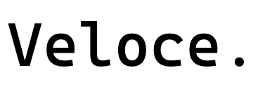

<!-- PROJECT LOGO -->
<br />
<div align="center">
  <a href="">
    
  </a>

  <h3 align="center">phetware</h3>

  <p align="center">
    An instant distributed computing ML/DL toolbox based on Ray Stack!
    <br />
    <a href=""><strong>Explore the docs »</strong></a>
    <br />
    <br />
    <a href="">View Demo</a>
    ·
    <a href="">Report Bug</a>
    ·
    <a href="">Request Feature</a>
  </p>
</div>

<!-- TABLE OF CONTENTS -->
<details>
  <summary>Table of Contents</summary>
  <ol>
    <li>
      <a href="#about-phetware">About phetware</a>
    </li>
    <li>
      <a href="#getting-started">Getting Started</a>
      <ul>
        <li><a href="#prerequisites">Prerequisites</a></li>
        <li><a href="#installation">Installation</a></li>
      </ul>
    </li>
    <li><a href="#usage">Usage</a></li>
    <li><a href="#roadmap">Roadmap</a></li>
    <li><a href="#contributing">Contributing</a></li>
    <li><a href="#license">License</a></li>
    <li><a href="#contact">Contact</a></li>
    <li><a href="#acknowledgments">Acknowledgments</a></li>
  </ol>
</details>

<!-- ABOUT THE PROJECT -->
## About `phetware`
__phetware__ is an `instant distributed computing` toolbox based on Ray Stack and ML/DL frameworks, which is flexible, efficient, and ease-of-use. It accelerates the development of any ML/DL training workload, on any cloud or local, at any number of workloads.

- One-line change to __instantly run__ workloads on any cloud provider or local laptop

- State-of-the-art like __out of box__ scaffoldings: train_fn and native NN architecture

- Flexible __modular__ to fit different use cases: core components, layers which can be used to build your own custom model/train_fn easily.

<!-- GETTING STARTED -->
## Getting Started

### Installation

- install through pip
```
pip install -U phetware
```

<!-- USAGE EXAMPLES -->
## Usage

### `train_fn` manner
```shell
# try wide and deep
python -m labs.wdl
```

### Native NN manner
```shell
# comming soon
```

<!-- ROADMAP -->
## Roadmap

### CTR domain

- [x] Wide and Deep
- [x] DeepFM
- [ ] FNN
- [ ] PNN
- [ ] DIN
- [ ] DIEN
<!-- - [ ] AFM
- [ ] NFM
- [ ] PLM -->


<!-- CONTRIBUTING -->
## Contributing

<!-- LICENSE -->
## License

<!-- CONTACT -->
## Contact

<!-- ACKNOWLEDGMENTS -->
## Acknowledgments
