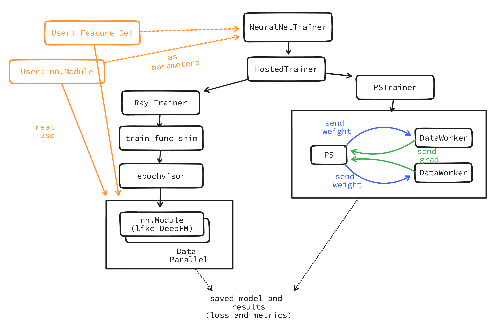

# Enscale (WIP)
## About
Enscale is an `instant distributed computing` toolbox based on the Ray stack and ML/DL frameworks, which is scalable, efficient, and easy-to-use. It accelerates the development of any ML/DL training workload, on any cloud or local, at any number of workloads.

## Goals
- Launch any ML/DL workloads **instantly** locally or to any cloud
- **Scale** your own single-machine neural network modules to a native **distributed** manner
- Apply **heterogeneous** architecture
- **Data scientist-friendly** API
- **Sparse** and **dense feature** definitions

## Non-Goals
- Not a neural network library, there are only some benchmark modules provided.

## Getting Started
### Prerequisites
- ray `1.10.1` and torch `1.10.1`
- or just run `pip install -r requirements/requirements.txt`

### Features
#### 1. Data scientist-friendly `NeuralNetTrainer`
```python
trainer = NeuralNetTrainer(
    # module and dataset configs
    module=LR, # your own nn.Module or built in modules
    module_params={
        "dense_defs": dense_defs,
        "sparse_defs": sparse_defs,
        "seed": rand_seed,
    },
    dataset=datasets,
    dataset_options=torch_dataset_options,
    # trainer configs
    epochs=20,
    batch_size=512,
    loss_fn=nn.BCELoss(),
    optimizer=torch.optim.Adam,
    metric_fns=[auroc],
    num_workers=num_workers,
    use_gpu=use_gpu,
    callbacks=["json", "tbx"],
)
results = trainer.run()
pprint_results(results)
```

[Check full example code](examples/use_cases/lr_nnmodule.py) or just run `python -m examples.use_cases.lr_nnmodule`
#### 2. Common models for RecSys: PyTorch-based modules
- [LR](examples/benchmarks/lr.py)
- [FM](examples/benchmarks/fm.py)
- pre-train based [FNN](examples/benchmarks/fnn.py)
- PNN family: [inner product based PNN](examples/benchmarks/ipnn.py), [outer product based PNN](examples/benchmarks/opnn.py), and [hybrid PNN](examples/benchmarks/pnn.py)
- [Wide-and-Deep](examples/benchmarks/wdl.py) and [its variants](examples/benchmarks/wdl_fm.py)
- [DeepFM](examples/benchmarks/deepfm.py)

[Check benchmarks directory](examples/benchmarks) or just run `python -m examples.benchmarks.<SCRIPT_NAME>`
#### 3. The sparse or dense feature and data processing API
```python
dataloader = DataLoader("examples/dataset/ctr/criteo_100k.txt")
dataloader = (dataloader
    .set_label_column(label_name="label")
    .set_dense_features(feat_names=[f"I{i}" for i in range(1, 14)])
    .set_sparse_features(feat_names=[f"C{i}" for i in range(1, 27)])
    # this order should follow the data file
    .set_features_order(order=("dense", "sparse"))
)
# train set and test set
datasets = dataloader.split()
# dense features definition
dense_defs = dataloader.dense_defs
# sparse features definition
sparse_defs = dataloader.sparse_defs
```
[Check full example code](examples/use_cases/lr_nnmodule.py) or just run `python -m examples.use_cases.lr_nnmodule`

#### 4. `train_func` shim: For Ray users to wrap your `nn.Module`
```diff
from enscale.train_fn import WideAndDeep as WDLTrainFn
from enscale.train_fn import RecommendationFn
from enscale.model.ctr import WideAndDeep as WDL

class MyWDL(nn.Module):
    ...

trainer = Trainer("torch", num_workers=num_workers, use_gpu=use_gpu)
trainer.start()
trainer.run(
+   train_func=RecommendationFn(MyWDL),
+   # or train_func=WDLTrainFn,
+   # or train_func=RecommendationFn(WDL),
    dataset=datasets,
    config={
        "epochs": 50,
        "batch_size": 32,
        "loss_fn": nn.BCELoss(),
        "optimizer": orch.optim.Adam,
        ...
    },
)
trainer.shutdown()
```
[Check full example code](examples/use_cases/wdl_raytrain.py) or just run `python -m examples.use_cases.wdl_raytrain`
#### 5. Heterogeneous: Sync Parameter Server
```diff
trainer = NeuralNetTrainer(
    module=WideAndDeep,
    module_params={...},
    dataset=datasets,
    epochs=5,
    batch_size=512,
    loss_fn=nn.BCELoss(),
    optimizer=torch.optim.Adam,
    # set heterogeneous_strategy
+   heterogeneous_strategy=PSStrategy(
+       update_strategy=UpdateStrategy.Sync
+   ),
    num_workers=num_workers,
    use_gpu=use_gpu,
)
trainer.run()
```
[Check full example code](examples/use_cases/wdl_hetero.py) or just run `python -m examples.use_cases.wdl_hetero`

#### 6. `OptimizerStack` and `LossFnStack`
```python
"loss_fn": LossFnStack(
    # support multiple loss functions with fixed weight
    dict(fn=nn.BCELoss(), weight=0.8),
    dict(fn=nn.HingeEmbeddingLoss(), weight=0.2),
)

"optimizer": OptimizerStack(
    # support multiple optimizers
    dict(cls=torch.optim.Adam, model_key="deep_model"),
    dict(
        cls=FTRL,
        args=dict(lr=0.925, weight_decay=1e-3),
        model_key="wide_model",
    ),
),
```
[Check full example code](examples/use_cases/wdl_raytrain.py) or just run `python -m examples.use_cases.wdl_raytrain`
## Architecture



## Roadmap

> This project is aimed to deal with distributed ML/DL computing based on the Ray stack with PyTorch.

- Heterogeneous Strategy on Distributed Training
  - [x] Sync Parameter Server
  - [ ] Aync Parameter Server
  - [ ] Hybird Phase 1: use sync or async for the dense or sparse component as you like, under homogeneous architecture
  - [ ] Hybird Phase 2 (compelete): you can choose async PS for the sparse component, and sync Ring Allreduce (like PyTorch's DDP) for the dense component
- Framework Support
  - [x] PyTorch: currently no specific plan to support other frameworks
- Advanced Parallel Mechanism
  - [ ] Heavy integrated [torchrec](https://github.com/pytorch/torchrec)

## License
Enscale is MIT licensed, as found in the [LICENSE](LICENSE) file.
